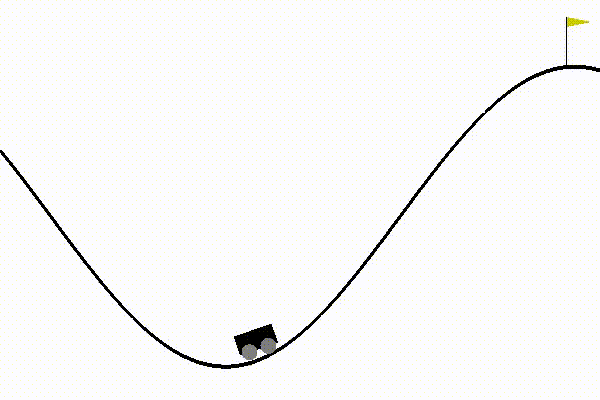

# Reinforcement Learning

## Description
In this repository I will upload the work done in my journey to learn Reinforcement Learning from scratch.

## Files in Repository
* **RL1 - Random and Linear Regression.ipynb:** Jupyter notebook in which I compare the performance of a random model with a linear regression in two games from OpenAI Gym library.
* **RL2 - QLearning with bins.ipynb** Train a model with QLearning to improve the performance of previous models in the same games of OpenAI Gym library.

## Dependencies
A copy of ffmpeg that can be recognized by Anaconda might be needed. To install it, run `conda install -c conda-forge ffmpeg` in a terminal.
As of February 10 2021 there is an issue with a gym file to record the video by Wrappers. It can be solved manually based on this [link](https://github.com/openai/gym/issues/1925).

## Sample
With RL an agent can play a game as the following:

